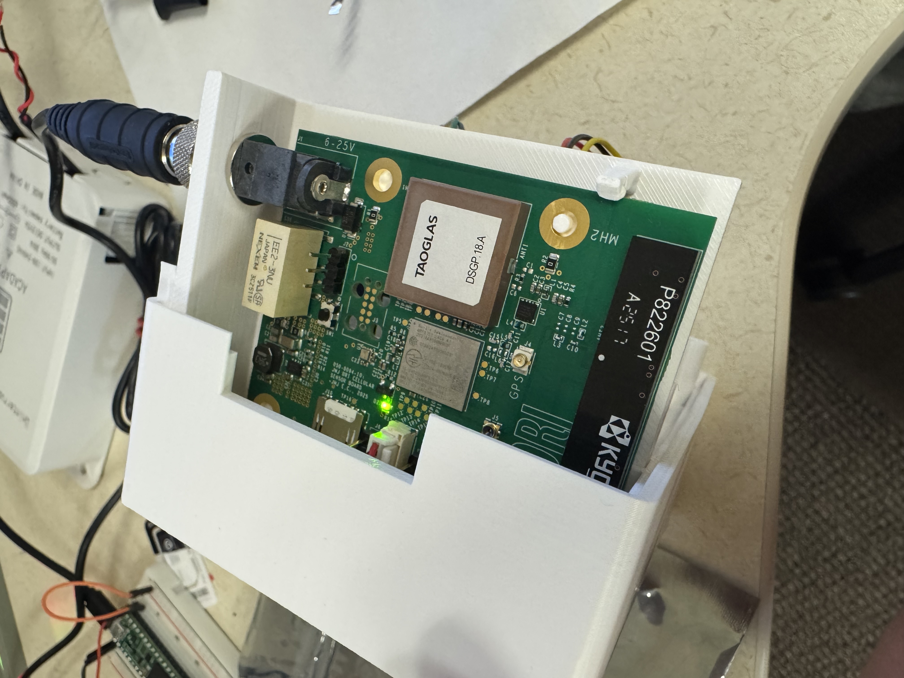
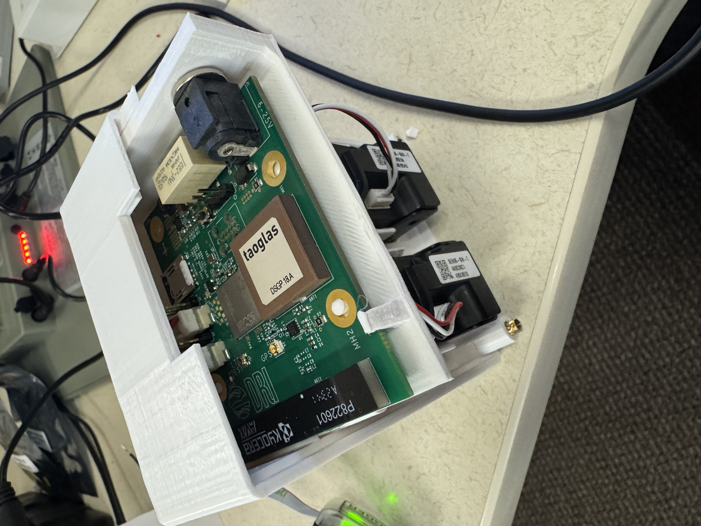
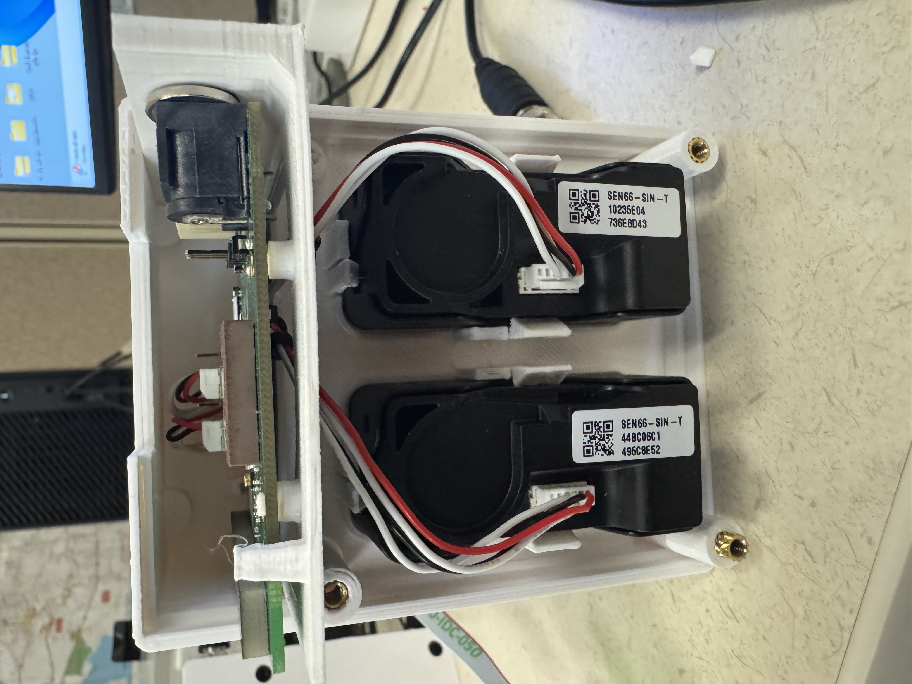
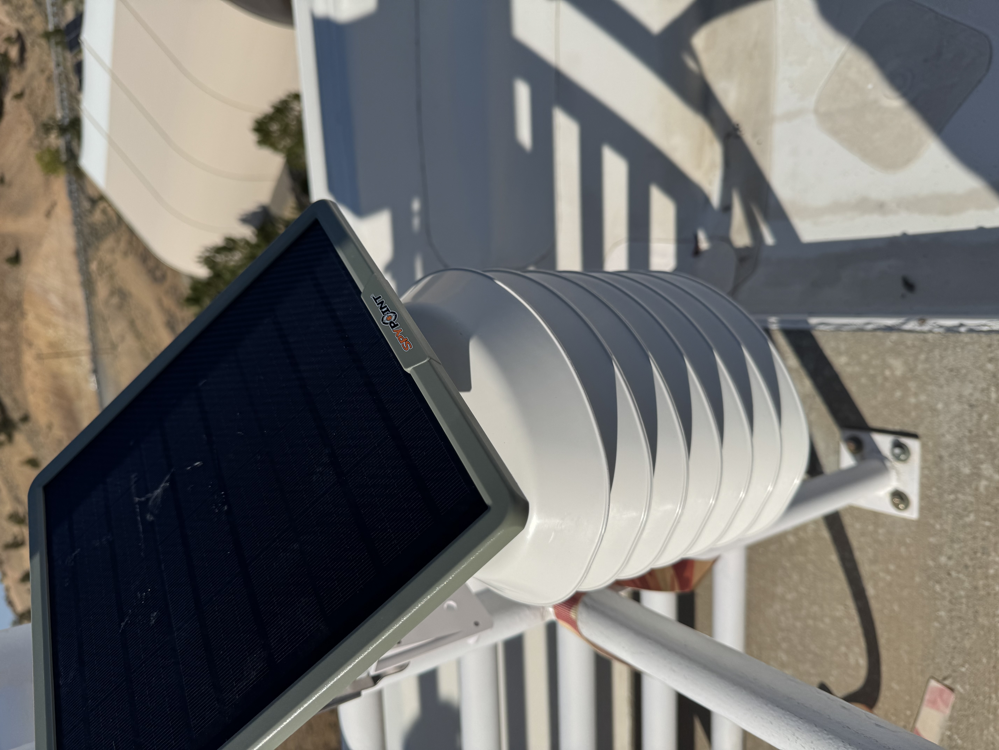
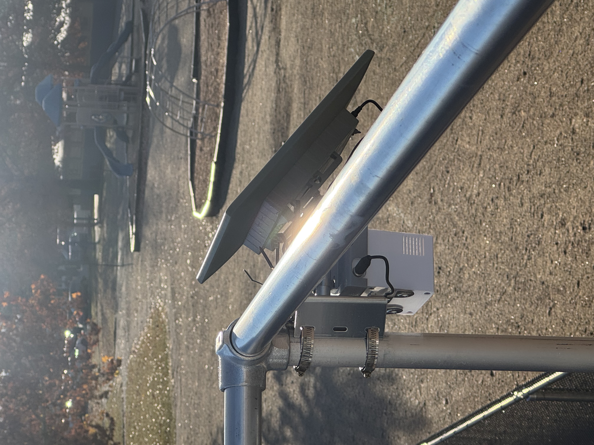
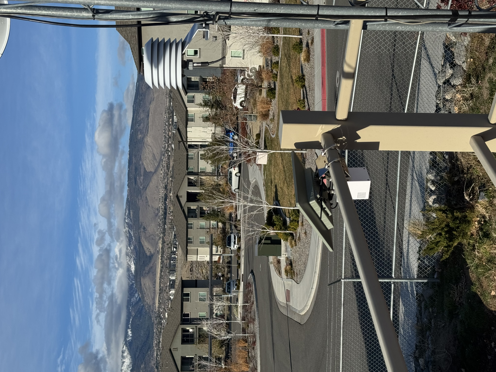

# nRF9151 Custom PCB Firmware — LTE / MQTT IoT Pipeline

> A **DRI** project. Firmware for a custom nRF9151 carrier board.

A portfolio-safe embedded-to-cloud example for collecting environmental sensor data with a Nordic nRF9151-class LTE/GNSS device and forwarding telemetry through MQTT into MongoDB.

## Interfaces used

**SPI · I2C · UART · GPIO**, on a carrier PCB with an I2C multiplexer.

| Bus | Instance | What is on it |
|---|---|---|
| I2C | `i2c1` | Sensirion **SEN66** — PM, VOC, NOx, temperature, humidity |
| I2C | `i2c2` | Bosch **BMP581** — temperature, pressure |
| SPI | `spi3` | GigaDevice **gd25wb256e** 256 Mbit (32 MB) NOR flash |
| UART | `uart0` | Console / debug through the SEGGER J-Link mini |
| GPIO | — | Status LED, plus ADC for battery sensing |

GPIO port 1 is left alone: TF-M reserves it for the secure world by default.

This repository intentionally uses placeholder broker, APN, topic, and database values. It is meant to show the architecture and implementation approach without exposing production infrastructure or private research code.

## Architecture

```text
SEN66/BMP581 sensors -> nRF9151 firmware -> LTE-M/NB-IoT -> MQTT broker -> Python bridge -> MongoDB
```

## Hardware Photos

<p align="center">
  
  
  
</p>

<p align="center">
  
  
  
</p>

- **LTE/GNSS electronics:** Nordic-class cellular board integrated into a 3D-printed carrier with antenna, power, and enclosure access.
- **Airflow module:** internal dual-fan layout used to move sampled air through the sensing enclosure.
- **Field node:** solar-powered outdoor deployment with weather-aware mounting and a louvered environmental sensor housing.

## Repository Layout

- `firmware/nrf9151_zephyr/` - Zephyr/Nordic firmware example for LTE, GNSS, sensor sampling, MQTT publishing, flash buffering, RTC scheduling, and watchdog recovery.
- `backend/mqtt_mongodb_bridge/` - Python MQTT subscriber that normalizes telemetry and stores it in MongoDB.
- `docs/` - high-level setup notes for the cloud and device pipeline.
- `docs/images/` - architecture and hardware photos.

## Features

- LTE-M/NB-IoT connectivity workflow using Nordic modem libraries
- GNSS location acquisition before telemetry upload
- MQTT telemetry publishing with configurable topics
- SEN66 and BMP581 sensor integration over I2C
- Adaptive sampling intervals based on PM2.5 levels
- Flash buffering for recent sensor and location payloads
- Watchdog and RTC-based scheduling for field reliability
- MongoDB ingestion service with environment-based configuration

## Privacy and Safety Notes

The public version removes:

- real MongoDB credentials and cluster names
- real MQTT broker IP addresses
- personal names and organization-specific identifiers
- build outputs containing local machine paths
- private topic names and internal device labels

Before using this in a real deployment, create private local config files from the examples and keep them out of Git.

## Firmware Setup

Install Nordic Connect SDK and build from the firmware directory:

```powershell
cd firmware/nrf9151_zephyr
west build -b nrf9151dk/nrf9151/ns -- -DCONF_FILE=prj.conf
```

Update `prj.conf` and a private `include/secrets.h` with your own MQTT broker, APN, and topics before deploying to hardware.

## Backend Setup

```powershell
cd backend/mqtt_mongodb_bridge
pip install -r requirements.txt
$env:MONGODB_URI="<your MongoDB connection string>"
$env:MQTT_HOST="localhost"
python bridge.py
```

## Example MQTT Topics

- `devices/example-device/telemetry`
- `devices/example-device/location`
- `devices/example-device/logs`

## Status

This repository is a sanitized reference implementation. Hardware pin mappings, APN credentials, broker addresses, and database credentials must be supplied by the user for an actual deployment.
